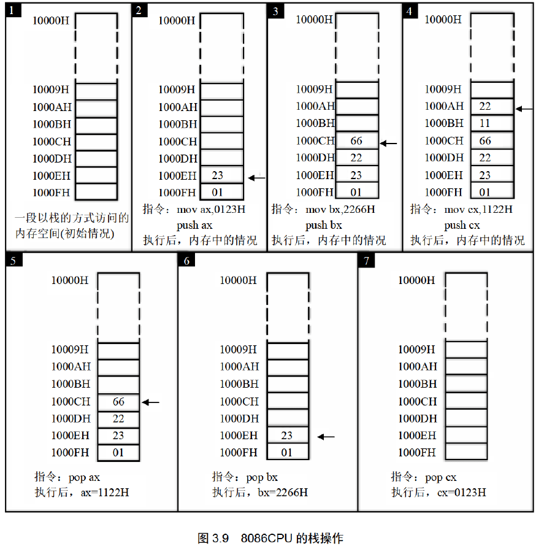
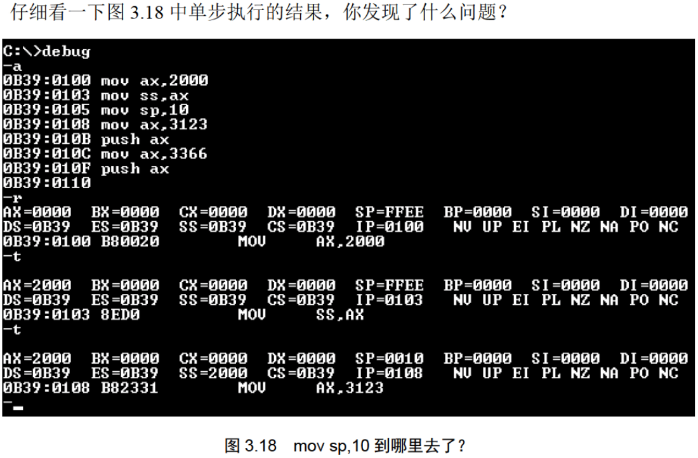
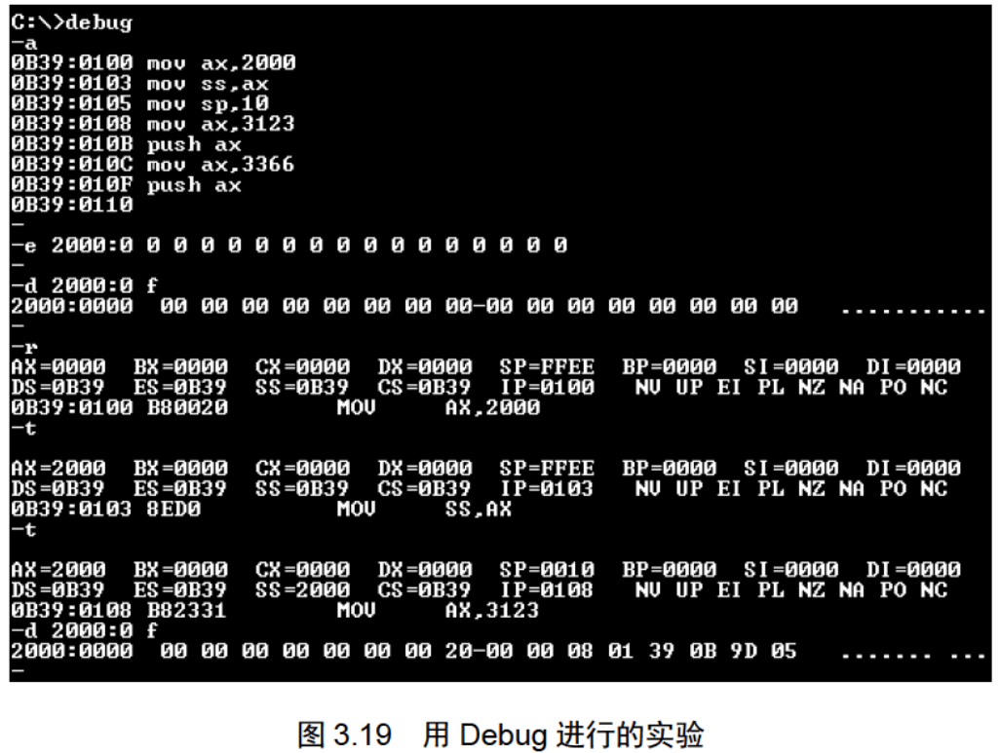
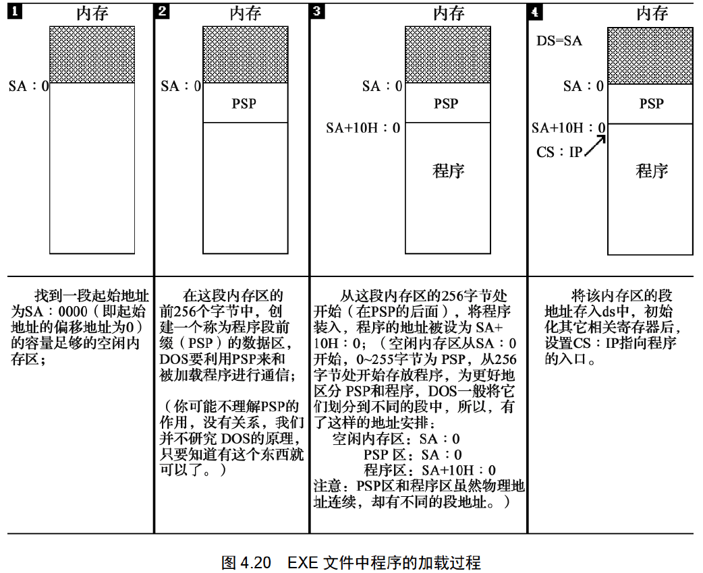
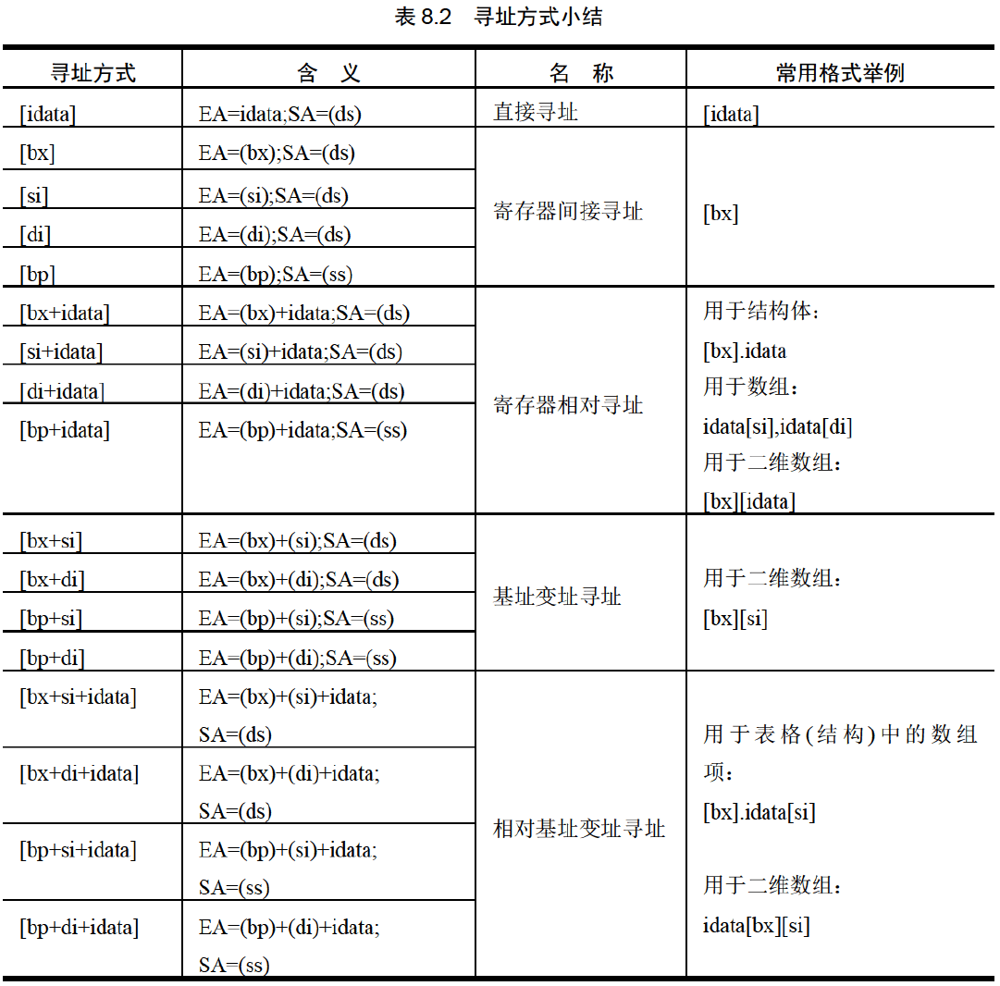

## 汇编语言

## Ch1 基础知识

机器语言：机器指令的集合。

机器指令：一列二进制数，电子计算机将之转为一系列高低电平

汇编语言由以下3类指令组成：

- 汇编指令：机器指令的助记符，和机器码一一对应。(核心)
- 伪指令：无对应机器码，由编译器执行，计算机不执行。
- 其他符号：如+-*/，由编译器识别，无对应机器码。

**指令**和**数据**在存储器上都表示成**二进制信息**，CPU可将同一段二进制信息当作指令/数据来执行/处理。

存储单元：微型计算机的存储单元1Byte

CPU要读写数据，须和外部器件(即芯片)进行3类信息的交互

- 地址信息:存储单元的地址
- 控制信息:器件的选择，读或写的命令
- 数据信息:读或写的数据

总线：连接CPU和其他芯片的导线，在逻辑上可分为3类

- 地址总线：指定存储单元，决定寻址能力。n根地址线<-->地址总线宽度=n<-->最大寻址2<sup>n</sup>个存储单元。**地址总线传送的是地址而非数据。寻址能力是数量，没有单位。**
- 数据总线：决定CPU和外界的数据传输速度。8根数据总线一次可传8bit(1Byte)
- 控制总线：是一些不同控制线的集合，决定CPU对外部器件的控制能力。

主板：上有核心器件(CPU、存储器、外围芯片、扩展插槽等)，器件通过总线相连。

接口卡：插在扩展插槽上，根据CPU命令控制外设工作。

**内存地址空间**：各种存储器在物理上都是独立的器件，但CPU在操纵时都将其当作内存对待，总的看作一个由若干单元组成的**逻辑存储器**，即内存地址空间，其大小受CPU地址总线宽度的限制。不同计算机系统的内存地址空间的分配情况不同。

## Ch2 寄存器

在CPU中：

- 运算器进行信息处理
- 寄存器进行信息存储
- 控制器控制各种器件工作
- 内部总线连接CPU内部各器件，外部总线联系CPU和主板上其他器件

对汇编程序员来说，CPU中的主要部件是寄存器，程序员可以用指令读写寄存器，通过改变寄存器中的内容实现对CPU的控制。

不同的CPU，寄存器的个数、结构不相同。8086CPU有14个寄存器，均为16位，可以存储两个字节的数据。AX,BX,CX,DX通常存放一般性数据，称为**通用寄存器**

8086CPU的上一代CPU中的寄存器都是8位，为保证兼容，8086CPU的AX,BX,CX,DX都可分为两个可独立使用的8位寄存器，如AX可分为AH(高8位)和AL(低8位)

出于对兼容性的考虑，8086CPU可以一次性处理两种尺寸的数据：

- 字节(Byte)，一个字节由8个bit组成，可存在8位寄存器中
- 字(word)，一个字由两个字节组成，分别称为这个字的高位字节和低位字节，可以存在16位寄存器中

AH和AL中的数据，既可以看成字型数据的高8位和低8位，也可以看成两个独立的字节型数据。

汇编指令`mov ax,18`等价于`AX=18`
汇编指令`mov ax,bx`等价于`AX=BX`
汇编指令`add ax,18`等价于`AX=AX+18`
汇编指令`add ax,bx`等价于`AX=AX+BX`

汇编指令和寄存器名称**不区分大小写**，mov同MOV，ax同AX

汇编指令的两个**操作对象的位数应当一致**

**物理地址**：CPU访问内存单元时，要给出内存单元的地址。所有的内存单元构成的存储空间是一个一维线性空间，每个内存单元在空间中都有唯一的地址，称为物理地址。CPU在地址总线上发出物理地址前，必须现在内部形成物理地址，不同CPU形成物理地址的方式不同。

8086是16位结构的CPU：

- 运算器一次最多处理16位数据
- 寄存器最大宽度为16位
- 寄存器和运算器之间的通路为16位

总之，16位CPU能够一次性处理、传输、暂存16位的地址

8086CPU有20位地址总线，可传送20位地址，达到1MB寻址能力。16位CPU若将地址从内部简单发出，则只能传送16位地址。8086CPU采用在内部用两个16位地址合成的方法形成20位的物理地址，即**物理地址=段地址×16+偏移地址**，本质是**“物理地址=基础地址+偏移地址”**的一种具体实现。

**段的概念**：内存并没有分段，段的划分来自CPU，由于8086CPU采用“物理地址=段地址×16+偏移地址”的方式给出内存单元的物理地址，我们可以用分段的方式管理内存。

**段寄存器**：存放段地址。8086CPU有4个段寄存器：CS、DS、SS、ES

**CS**(代码段寄存器)和**IP**(指令指针寄存器)是8086CPU中最关键的两个寄存器，它们指示CPU当前要读取指令的地址。

8086CPU的工作过程简要描述如下：

1. 从CS:IP指向的内存单元读取指令，进入指令缓冲器
2. IP=IP+所读取指令长度，从而指向下一条指令
3. 执行指令。转到步骤(1)，重复该过程

修改CS、IP的指令：`jmp 段地址:偏移地址`(只能在Debug中使用)，其功能为用指令中给出的段地址修改CS，偏移地址修改IP。若只想修改IP的内容，可用`jmp 某一合法寄存器`，其功能为用寄存器中的值修改IP，如`jmp ax`在含义上等同于`mov IP,ax`，但**mov指令不能用于设置CS、IP的值**

### 实验1 用Debug查看CPU和内存

1. R命令：查看、修改CPU中**寄存器**的内容
   - `r`查看所有寄存器
   - `r 寄存器名`，然后输入数据即可修改
   
2. D命令：查看**内存**中的内容
   
   - `d 段地址:偏移地址`
   
     左为每行起始地址；中间是指定地址开始128个内存单元的内容，每行最多16个；右为每个内存单元中的数据对应ASCII码字符
   
   - `d 段地址:起始偏移地址 结尾偏移地址`，可以指定D命令的查看范围
   
   - 直接`d`，从一预设地址开始，连续变化
   
3. E命令：改写**内存**中的内容

   - `e 段地址:偏移地址`从该地址开始逐一输入数据修改内存单元内容，按空格键显示下一个
   - `e 段地址:偏移地址 十六进制数(机器码) '字符' "字符串" ᠁ `

4. U命令：查看内存中机器码对应的汇编指令

   - `u 段地址:偏移地址`
   - 直接`u`，从一预设地址开始，连续变化

5. T命令：执行CS:IP指向的指令

6. A命令：向内存中写入汇编指令

   - `a 段地址:偏移地址`，然后输入，回车结束
   - 直接`a`，从一预设地址开始

## Ch3 寄存器(内存访问)

内存中字的存储：CPU用16位寄存器来存储一个字，高8位存放高位字节，低8位存放低位字节。

**字单元**：存放一个字型数据(16位)的内存单元，由两个地址连续的内存单元组成，高地址内存单元存放字型数据的高位字节，低地址内存单元存放字型数据的低位字节。

起始地址为N的字单元简称为**N地址字单元**。

任何两个地址连续的内存单元(N号单元和N+1号单元)，既可看成两个内存单元，也可看成一个地址为N的字单元的高地位字节单元。

**DS**(数据段寄存器)：存放要访问数据的段地址

`mov`指令的第三种用法

- `mov 寄存器名,[内存单元的偏移地址]`，内存单元的段地址自动取`ds`中的数据
- 反之亦可，`mov [偏移地址],寄存器名`

**8086CPU不支持将数据直接送入段寄存器**，必须通过一般寄存器传入

`mov`指令操作对象小结：

- `mov 寄存器,数据/寄存器/段寄存器/内存单元`，可传入任何类型
- `mov 段寄存器,寄存器/内存单元`，不可向段寄存器传入数据或段寄存器
- `mov 内存单元,寄存器/段寄存器`，不可向内存单元传入数据或内存单元

`add`指令(`sub`亦同)操作对象小结:

- `add 寄存器,数据/寄存器/内存单元`，寄存器不可加上段寄存器
- `add`不可对段寄存器操作
- `add 内存单元,寄存器`

数据段：一组长度为N(N≤64KB)、地址连续、起始地址为16的倍数的内存单元，段地址存放在`ds`段寄存器中

8086CPU提供的栈机制

- `push ax`表示将寄存器ax中的数据送入栈中
- `pop ax`表示从栈顶取数据送入ax
- 入栈和出栈操作都是以**字**为单位进行的，高地址单元存放高8位，低地址单元存放低8位
- 入栈时，栈顶从高地址向低地址方向增长
- 用栈来暂存以后需要恢复的寄存器中的内容时，出栈的顺序要和入栈的顺序相反(LIFO)
- 
  

CPU如何知道栈顶位置：栈顶的段地址存放在段寄存器SS,偏移地址存放在寄存器SP。SS:SP永远指向栈顶元素(栈空时SS:SP指向栈的最底部单元下面的单元)

`push ax`的具体执行过程(先减SP，后写内存)：

1. SP=SP-2，则SS:SP指向当前栈顶前面的单元(新的栈顶)
2. 将ax中的内容送入SS:SP指向的内存单元处

`pop ax`的具体执行过程(先读内存，后加SP)：

1. 将SS:SP指向的内存单元处的数据送入ax中
2. SP=SP+2，则SS:SP指向当前栈顶下面的单元(新的栈顶)

栈顶超界问题：栈满时push或栈空时pop均会发生。8086CPU没有寄存器指定栈空间的范围，无法在push和pop时检测栈顶和栈底，不保证对栈的操作不会超界，编程中要自己注意栈的大小。

8086CPU的工作机理只考虑当前的情况：

- 只知道当前的栈顶在何处，不知道栈空间的大小
- 只知道当前要执行的指令在何处(CS:IP)，不知道要执行的指令有多少

因为栈空间就是一段可以特殊方式进行访问的内存空间。故`push`和`pop`指令的实质就是一种**内存传送指令**，可以在寄存器和内存之间传送数据。

`push`,`pop`和`mov`的不同之处：

- `mov`指令访问的内存单元的地址在指令中给出；`push`,`pop`访问的地址则由SS:SP指出
- CPU执行`mov`指令只需一步操作；`push`,`pop`则需要两步操作

`push`,`pop`等栈操作指令只修改SP，则栈顶的变化范围最大为0~FFFFH

`push`,`pop`指令用法小结:

- `push (段)寄存器`  将(段)寄存器中的数据入栈
- `pop (段)寄存器`  出栈，用一个(段)寄存器接受出栈的数据
- `push [内存单元的偏移地址]`  将一个内存**字**单元处的**字**入栈(栈操作都是以**字**为单位)
- `pop [内存单元的偏移地址]`  出栈，用一个内存**字**单元接收出栈的数据

栈段：可以将一组长度为N(N≤64KB)、地址连续、起始地址为16的倍数的内存单元当作栈空间来使用，从而定义了一个栈段。这仅仅是编程时的一种安排，要将SS:SP指向我们定义的栈段才能让CPU自动将其当作栈空间访问。

**段的综述**：将一段内存定义为一个段，用段地址指示段，用偏移地址访问段内的单元

- 数据段：段地址放在`DS`中，用`mov`,`add`,`sub`等**访问内存单元**的指令时，CPU将数据段中的内容当作数据来访问
- 代码段：段地址放在`CS`中，将段中第一条指令的偏移地址放在`IP`中，CPU就将执行代码段中的指令
- 栈段：段地址放在`SS`中，将栈顶单元的偏移地址放在`SP`中，CPU在需要进行栈操作时就将定义的栈段当作栈空间来用
- 一段内存，既可以是代码的存储空间，又可以是数据的存储空间，还可以是栈空间，亦或什么都不是。关键在CPU中寄存器的设置，即`CS`,`IP`,`SS`,`SP`,`DS`的指向
- 我们一定要清楚，什么是我们的安排，如何让CPU按照我们的安排行事

### 实验2 用机器指令和汇编指令编程

Debug靠什么来执行D命令？ 当然是一段程序。
谁来执行这段程序？当然是CPU.
CPU在访问内存单元时从哪里得到内存单元的段地址？从段寄存器中得到。
所以，Debug在其处理D命令的程序段中，必须有将段地址送入段寄存器的代码。
段寄存器有4个:CS,DS,SS,ES，将段地址送入那个寄存器呢？一般送入DS较方便。

对D命令、E命令、A命令、U命令这些可带有内存单元地址的命令，Debug提供了另一种符合CPU机理的格式，可用**段寄存器**表示内存单元的段地址：

- `d 段寄存器:偏移地址`  查看内存中的内容
- `e 段寄存器:偏移地址`  改写内存单元中的内容
- `a 段寄存器:偏移地址`  向内存中写入汇编指令
- `u 段寄存器:偏移地址`  查看内存中机器码对应汇编指令



结论：一般情况下，用T命令执行一条指令后，会停止继续执行，显示出当前CPU各寄存器的状态和下一步要执行的指令，但在执行修改段寄存器SS的指令时，下一条指令会紧接着被执行。原因涉及到**中断机制**，以后才会深入研究。



观察图3.19，分析为什么2000:0~2000:f中的内容会改变，尝试发现其中规律。

~~我发现的规律就只有2000:a~2000:d处似乎会存放下一条要执行命令的地址，也就是CS:IP的值，但这段前后的值却不知从何而来~~

## Ch4 第一个汇编程序

源程序从写出到执行的过程：

1. 编写汇编源程序
2. 对源程序进行编译连接(先编译源程序生成目标文件，再连接目标文件生成可执行文件)
   产生的可执行文件包含两部分内容：
   - 程序(从源程序中汇编指令翻译的机器码)和数据(源程序中定义的数据)
   - 相关的描述信息(如程序有多大、占用多少内存空间)
3. 执行可执行文件中的程序(操作系统依照可执行文件中的描述信息，将机器码和和数据载入内存并进行相关的初始化，然后由CPU执行)

下面是一段简单的汇编语言源程序

```asm
assume cs:codesg

codesg segment
    mov ax,0123H
    mov bx,0456H
    add ax,bx
    add ax,ax

    mov ax,4c00H
    int 21H
codesg ends

end
```

以上程序中出现了3种**伪指令**

1. `段名 segment`~`段名 ends`

   `segment`和`ends`是成对使用的伪指令，功能是定义一个段，`segment`说明段开始，`ends`说明段结束

   一个汇编程序由多个段组成，这些段被用来存放代码、数据或当作栈空间来用。

   一个有意义的汇编程序至少要有一个段，用来存放代码

2. `end`是汇编程序的结束标记，和`ends`不同，`end`的作用是标记整个程序的结束

3. `assume 段寄存器名:段名`，将段寄存器和某个具体的段相联系，不用深入理解

**程序返回**：程序结束后，将CPU的控制权交还给使它得以运行的程序

```asm
mov ax,4c00H
int 21H
```

目前不必理解这两条指令的含义，只需知道在程序末尾使用这两条指令即可实现程序返回

在DOS下编辑源程序可使用Edit，保存文件后缀名为asm

编译器可使用微软的masm，输入源程序文件，最多可得到3个输出：目标文件(.obj)、列表文件(.lst)、交叉引用文件(.crf)，其中后两个只是中间结果，按Enter即可让编译器忽略其生成


连接器可使用微软的Overlay Linker，按Enter可忽略映像文件和库文件的生成


连接的作用简要如下：

- 源程序很大时，可分为多个源程序文件来编译成多个目标文件，再连接生成一个可执行文件
- 程序调用了某个库文件中的子程序，需要将该库文件和该程序生成的目标文件连接到一起，生成一个可执行文件
- 源程序编译后得到存有机器码的目标文件，有些内容还不能直接用来生成可执行文件，连接程序将这些内容处理为最终的可执行信息

以简化的方式进行编译和连接：`masm 文件名;` `link 文件名;` 自动生成目标文件/可执行文件，忽略中间文件的生成。

目前直接生成的程序根本没有向显示器输出任何信息，无法直接看到结果。

可执行文件装载入内存并运行的过程：command根据文件名找到可执行文件，然后将可执行文件中的程序加载入内存，设置CS:IP指向程序入口。此后command暂停运行，CPU运行程序。程序运行结束后，返回到command中。


用Debug跟踪程序执行过程`debug 可执行文件名`

Debug将程序载入内存后，`cx`中存放的是程序机器码的字节长度。

用T命令单步执行程序中的每一条指令并观察结果。到`int 21`时，执行P命令，显示"Program terminated normally"，正常返回到Debug中。



实验3：编程、编译、连接、跟踪

## Ch5 [bx]和loop指令

要完整地描述一个内存单元，需要提供其**地址**和**长度(类型)**这两种信息

例如用`[0]`表示一个内存单元时，0为偏移地址，段地址默认在`ds`中，单元的长度(类型)由具体指令中的其他操作对象(如寄存器)指出

`[bx]`同样也表示一个内存单元，其偏移地址在`bx`中

在以后课程中，为描述简洁，约定符号`()`表示一个寄存器或一个内存单元中的内容
~~意义或可类比C语言中`*`间接寻址运算符~~
.png)

约定符号idata表示常量

`inc bx`的含义是`bx`中的内容加1

`loop`指令的格式是`loop 标号`，CPU执行loop指令时，进行两步操作:
1. (cx)=(cx)-1;
2. 判断`cx`中的值，非零则转至标号处继续执行，为零则向下执行

通常用`loop`指令实现循环功能，`cx`中存放循环次数

```asm
	;以下利用loop计算2^12
	mov ax,2
	mov cx,11
s:	add ax,ax
	loop s
```

**汇编源程序中，数据不能以字母开头**。如`A000h`要补0写成`0A000h`

Debug和编译器masm对指令的不同处理：

- 在masm编译器中，源程序`mov ax,[idata]`被当作`mov ax,idata`处理
- 要在源程序中将内存单元中的数据传入寄存器，有以下两种方式
  - 先将偏移地址送入寄存器`bx`，再用`[bx]`的方式访问内存单元
  - 用**段前缀**显式指明段地址所在的段寄存器，如`mov al,ds:[0]`，

考虑这样一个问题，计算ffff:0~ffff:b单元中的数据的和，结果存储在dx中

- ffff:0~ffff:b中的数据是8位的，不可直接累加到16位寄存器dx中，**运算对象类型不匹配**
- 也不可将ffff:0~ffff:b中的数据累加到dl中并设(dh)=0，因为dl数据范围只有0~255，易造成进位丢失，**结果可能超界**
- 目前的解决方法：用16位寄存器ax做中介，将内存单元中的8位数据赋值到一个16位寄存器ax中，再将ax中的数据加到dx上

不确定一段内存空间是否存放重要数据或代码时，随意向其中写入内容是很危险的。应该使用操作系统给我们分配的空间而不是直接用地址任意指定内存单元，在操作系统中安全、规矩地编程。但在学习汇编语言时，要获得底层的代码体验，就要尽量直接对硬件编程，自由直接地用汇编语言去操作真实的硬件。

只有在纯DOS方式(实模式)下才可能直接用汇编语言去操纵真实的硬件，而在运行于CPU保护模式下的操作系统中，硬件已被操作系统全面而严格地管理。

一般在DOS中，**0:200~0:2ff**(0200h~002ffh)这256个字节的空间是安全的，可以被使用。

实验4，综合运用[bx]和loop，在内存之间传送数据。

## Ch6 包含多个段的程序

合法地通过操作系统取得的空间都是安全的，操作系统不会让一个程序所用的空间和其他程序以及系统自己的空间相冲突。在操作系统允许的情况下，程序可以取得任意容量的空间。

程序取得所需空间的方法有两种，一是在加载程序时会程序分配，再就是程序在执行的过程中向系统申请。在本课程中不讨论第二种方法。

要在程序被加载时取得所需空间，就必须在源程序中做出说明，通过定义段来进行内存空间的获取。这是从内存空间获取的角度上谈定义段的问题，从程序规划的角度，为了程序设计上的清晰和方便，一般也都定义不同的段来存放它们。

### 在代码段中使用数据

考虑计算8个数据的和，结果存在`ax`寄存器中

在之前的课程中，我们只会累加某些内存单元中的数据，并不关心数据本身。而现在要累加的就是给定的数值，尽管可以将它们一个个加到寄存器中，但为了用循环的方法累加，要先将这些数据存储在一组地址连续的内存单元中。

```asm
assume cs:code
code segment
	dw 0123h,0456h,0789h,0abch,0defh,0fedh,0cbah,0987h;定义字型数据
	mov bx,0
	mov ax,0
	
	mov cx,8
  s:add ax,cs:[bx]
    add bx,2
    loop s
    
    mov ax,4c00h
    int 21h
code ends
end
```

这8个数据的段地址是多少？由于它们在代码段中，故其段地址在CS中。
这8个数据的偏移地址是多少？由于`dw`定义的数据处于代码段最开始，故其偏移地址从0开始。

用d命令可看到代码段中前16个字节是用`dw`定义的数据，第16个字节开始才是汇编指令所对应的机器码。

为了让程序在编译、连接后可在系统中直接运行，可在源程序中指明程序入口

```asm
assume cs:code
code segment
		dw 0123h,0456h,0789h,0abch,0defh,0fedh,0cbah,0987h;定义字型数据
start:	mov bx,0
		mov ax,0
	
		mov cx,8
  	s:  add ax,cs:[bx]
    	add bx,2
    	loop s
    
    	mov ax,4c00h
    int 21h
	code ends
	end start
```

在第一条指令前加上标号start，该标号又在伪指令end后面出现，就指明了程序的入口在标号start处。在编译、连接后，`end start`指明的程序入口被转化为一个入口地址，存储在可执行文件的描述信息中。当程序被加载入内存后，加载者从描述信息中读到程序的入口地址，设置CS:IP，这样CPU就从我们希望的地址处开始执行。

总之可以在源程序中用`end 标号`来安排程序的框架

```asm
assume cs:code
code segment
	...
	数据
    ...
start:
    ...
    代码
    ...
code ends
end start
```

### 在代码段中使用栈

问题：利用栈将8个给定的数据逆序存放。

思路：仍然用`dw`定义8个数据存放在CS:0~CS:F中，共8个字单元，依次将这8个字单元中的数据入栈、再出栈到8个字单元中。

首先要有一段可当作栈的内存空间，可用`dw`再定义16个字型数据，则可将CS:10~CS:2F的内存空间当作栈来用，而所定义的字型数据的值则没有意义，这时`dw`的作用是开辟内存空间。

### 将数据、代码、栈放入不同的段

```asm
assume cs:code,ds:data,ss:stack  ;assume是伪指令，仅在源程序中存在，不必深究

data segment
	dw...(定义数据)
data ends

stack segment
	dw...(开辟内存空间)
stack ends

code segment
start:mov ax,stack
	  mov ss,ax
	  mov sp,20h  ;设置栈顶ss:sp指向stack:20
      mov ax,data
      mov ds,ax  ;设置ds指向data段
      mov bx,0  ;设置ds:bx指向data段中的第一个单元
      mov cx,8
    s:push [bx]
      add bx,2
      loop s  ;以上将data段中的0~15单元中的8个字型数据依次入栈
      
      mov bx,0
      mov cx,8
      
   s0:pop [bx]
      add bx,2
      loop s0  ;以上依次出栈8个字型数据到data段中的0~15单元中
      
      mov ax,4c00h
      int 21h
code ends
end start
```

段地址的引用：一个段中的数据的段地址可由段名代表，偏移地址则看它在段中的位置。由于段名被编译器处理为**表示段地址的数值**，所以不能直接送入段寄存器，形如`mov ds,data`的指令是非法的，需要通用寄存器中转。

段的命名是任意的，仅仅为了便于阅读，仅在源程序中存在，CPU并不知道他们。

CPU到底如何处理我们定义的段中的内容，完全是靠程序中具体的汇编指令和对CS:IP、SS:SP、DS等寄存器的设置来决定。

实验5：编写、调试具有多个段的程序(重要)

## Ch7 更灵活的定位内存地址的方法

`and`和`or`指令：按位与/或运算
例如：将`al`的第0位设为1的指令：`or al,00000001B`
		 将`al`的第6位设为0的指令：`and al,10111111B`

以字符形式给出数据：用单引号括起，编译器将字符转化为对应的ASCII码，如`db 'unIX'`相当于`db 75H,6EH,49H,58H`，`mov al,'a'`相当于`mov al,61H`。

大小写转换

- 规律1：小写字母的ASCII码值比大写字母的ASCII码值大20H
- 然而目前在处理前无法预判字母的大小写
- 规律2：二进制下，ASCII码的第5位置1则必为小写字母，第5位置0则必为大写字母
- 转小写(第5位置1)用`or 8位寄存器,00100000b`，转大写(第5位置0)用`and 8位寄存器,11011111b`

可用[bx+idata]表示一个内存单元，其偏移地址为(bx)+idata，即bx中的数值加上idata。

`si`和`di`是8086CPU中和bx功能相近的寄存器，`si`和`di`不能分成两个8位寄存器来使用。

可以灵活使用`[bx+si+idata]`来定位内存单元，还可写成如下格式
```asm
mov ax,[bx+si+200]; 以下指令为不同写法
mov ax,[bx+200+si]
mov ax,200[bx][si]
mov ax,[bx].200[si]
mov ax,[bx][si].200
```

二重循环的处理：因为`loop`指令默认`cx`为循环计数器，所以要在每次开始内层循环时将外层循环的`cx`中的数值保存起来，在执行外层循环的`loop`指令前再恢复外层循环的`cx`数值。可以用闲置的寄存器暂存`cx`中的数值，但8086CPU只有14个寄存器，内层循环中寄存器很可能都被使用，因此可以考虑开辟一段内存空间放置需要暂存的数据。但这样则需记住数据放在哪个单元中，程序容易混乱。尽管必须使用内存来暂存书籍，但值得推敲的是，用怎样的结构来保存这些数据。一般来说，都应该**使用栈来暂存数据**。

```asm
assume cs:codesg,ds:datasg,ss:stacksg
datasg segment
  db 'ibm             '    ;每个字符串的长度均为16字节
  db 'dec             '    ;该程序将datasg段中每个单词改为大写字母
  db 'dos             '
  db 'vax             '
datasg ends

stacksg segment
  dw 0,0,0,0,0,0,0,0
stacksg ends

codesg segment
  start:mov ax,stacksg
        mov ss,ax
        mov sp,16
        mov ax,datasg
        mov ds,ax
        mov bx,0
        
        mov cx,4
  s0:   push cx
        mov si,0
        mov cx,3
        
   s:   mov al,[bx+si]
        and al,11011111b
        mov [bx+si],al
        inc si
        loop s
        
        add bx,16
        pop cx
        loop s0
        
        mov ax,4c00H
        int 21H
codesg ends
end start
```

实验6：实践课程中的程序

## Ch8 数据处理的两个基本问题

- 处理的数据在什么地方？
- 要处理的数据有多长？

以上两个问题，在机器指令中必须给以明确或隐含的说明，否则计算机就无法工作。

定义描述性符号：reg表示一个寄存器，sreg表示一个段寄存器
reg={ax,bx,cx,dx,ah,al,bh,bl,ch,cl,dh,dl,sp,bp,si,di}
sreg={ds,ss,cs,es}

在8086CPU中，只有`bx`、`si`、`di`、`bp`这4个寄存器可以用在`[]`中进行内存单元的寻址。
这4个寄存器只能单个出现或以4种组合出现：bx+si、bx+di、bp+si、bp+di。
只要在`[]`中使用寄存器`bp`且未显性给出段地址，则段地址默认在`ss`中(而不是`ds`中，这和`bx`不同)

绝大部分机器指令都是进行数据处理的指令，大致可分为3类：读取、写入、运算

在机器指令这一层，不关心数据的值是多少，而关心**指令执行前一刻**，它将要处理的数据所在的**位置**，数据可以在3个地方：CPU内部、内存、端口(后面再讨论)。

汇编语言中用3个概念表达数据的位置：

- 立即数(idata)，直接包含在机器指令中。如`mov bx,1`，数据在CPU内部的**指令缓冲器**
- 寄存器。如`mov bx,[0]`，数据在ds:0单元
- 段地址(SA)和偏移地址(EA)。如`mov bx,ax`，数据在CPU内部的ax寄存器

寻址方式：当数据存放在内存中时，可以用多种方式给定内存单元的偏移地址，这种定位内存单元的方法一般称为寻址方式。


8086CPU可以处理两种尺寸的数据(byte和word)，所以在机器指令中要指明，指令进行的是字操作还是字节操作。汇编语言用以下方式解决：

- 通过寄存器名指明要处理数据的尺寸
- 在无寄存器名存在的情况下，用操作符`X ptr`指明内存单元的长度，X在汇编指令中可以为byte(字节单元)或word(字单元)
  - 如`add word ptr [bx],2`指明了指令访问的内存单元是一个**字单元**
  - 如`inc byte ptr ds:[0]`指明了指令访问的内存单元是一个**字节单元**
- 有些指令默认了访问的是字单元还是字节单元，如`push [1000H]`就不用指明，因为`push`指令只进行字操作

8086CPU提供的如[bx+si+idata]的寻址方式为结构化数据的处理提供了方便。
一般来说，可以用[bx+idata+si]的方式来访问结构体中的数据。用bx定位整个结构体，用idata定位结构体中的某个数据项，用si定位数组项中的每个元素。为此，汇编语言提供了贴切的书写方式如`[bx].idata[si]`

#### `div`指令

`div`是除法指令，用`div`做除法应注意以下问题

- 除数：有8位和16位两种，在一个reg或内存单元中。
- 被除数：默认放在AX或AX和DX中。若除数为8位，则被除数为16位，默认在AX中存放；若除数为16位，则被除数为32位，在AX和DX中存放，AX存放低16位，DX存放高16位
- 结果：若除数为8位，则AL存储除法操作的商，AH存储除法操作的余数。若除数为16位，则AX存储除法操作的商，DX存储除法操作的余数。

`div`指令格式如下：

- `div reg`
- `div X(byte/word) ptr 内存单元`
  - 如`div byte ptr ds:[0]`的含义为：(al)=(ax)/((ds)\*16+0)的商,(ah)=(ax)/((ds)\*16+0)的余数
  - 如`div word ptr [bx+si+8]`的含义为：(ax)=[(dx)\*10000H+(ax)]/((ds\*16+(bx)+(si)+8)的商,(dx)=[(dx)\*10000H+(ax)]/((ds\*16+(bx)+(si)+8)的余数

伪指令`dd`用来定义dword(double word)双字型数据

#### `dup`指令

`dup`是一个操作符，用来和db,dw,dd等数据定义伪指令配合，进行数据的重复
`dup`的使用格式：`db/dw/dd 重复次数 dup (重复的字节/字/双字型数据)`

- 如`db 3 dup (0)`定义了3个字节，其值都是0，相当于`db 0,0,0`
- 如`db 3 dup ('abc','ABC')`定义了18个字节，其值为'abcABCabcABCabcABC'

实验7：寻址方式在结构化数据访问中的应用(目前为止最复杂的程序)

## Ch9 转移指令的原理

可以修改IP，或同时修改CS和IP的指令统称为**转移指令**。概括地讲，转移指令就是可以控制CPU执行内存中某处代码的指令。

8086CPU的转移行为有以下几类：

- **段内转移**：只修改IP
  - 由于转移指令对IP的修改范围不同，段内转移又分为**短转移**和**近转移**
  - 短转移对IP的修改范围：-128~127
  - 近转移对IP的修改范围：-32768~32767
- **段间转移**：同时修改CS和IP

8086CPU的转移指令分为以下几类：

- 无条件转移指令(如`jmp`)
- 条件转移指令
- 循环指令(如`loop`)
- 过程
- 中断

操作符`offset`在汇编语言中是由编译器处理的符号，其功能是**取得标号的偏移地址**。
如`mov ax,offset start`相当于指令`mov ax,0`，因为`start`是代码段中的标号，它标记的指令是代码段中第一条指令，偏移地址为0

`jmp`指令为无条件转移指令，可只修改IP，也可同时修改`CS`和`IP`。
`jmp`指令要给出两种信息：

- 转移的目的地址
- 转移的距离(段内短转移、段内近转移、段间转移)

给出目的地址的方法不同，转移位置不同，对应`jmp`指令的格式也不同。下面以给出目的地址的不同方法为主线讲解`jmp`指令的主要应用格式和CPU执行转移指令的基本原理。

### 根据位移进行转移的`jmp`指令

`jmp short 标号`(段内短转移)和`jmp near ptr 标号`(段内近转移)

汇编指令`jmp short s`翻译成的机器码不包含转移的目的地址，这说明CPU在执行该指令时**不需要转移的目的地址**。在`jmp short 标号`指令对应的机器码中包含的是转移的**位移**，如`EB 03`即将当前的IP向后移动3个字节。位移是编译器根据汇编指令中的“标号”计算出来的(标号处地址-`jmp`指令后的第一个字节的地址)，用补码表示。

实际上`jmp short 标号`的功能为：(IP)=(IP)+8位位移(范围为-128~127)
实际上`jmp near ptr 标号`的功能为：(IP)=(IP)+16位位移(范围为-32768~32767)

### 转移地址在指令中的`jmp`指令

`jmp far ptr 标号`(段间转移，又称远转移)，功能为用标号所在段的段地址修改CS，用标号在段中的偏移地址修改IP。

### 转移地址在寄存器中的`jmp`指令

`jmp 16位reg`，功能为(IP)=(16位reg)，参见前文2.11节

### 转移地址在内存中的`jmp`指令

`jmp word ptr 内存单元地址`(段内转移)，从内存单元地址处开始存放着一个字，是转移的目的偏移地址，即(IP)=(内存单元地址)。内存单元地址可用寻址方式的任一格式给出。

`jmp dword ptr 内存单元地址`(段间转移)，从内存单元地址开始处存放着两个字，高地址处的字是转移的目的段地址，低地址处的字是转移的目的偏移地址，即(CS)=(内存单元地址+2),(IP)=(内存单元地址)。内存单元地址可用寻址方式的任一格式给出。

### `jcxz`指令

`jcxz 标号`，只有当(cx)为0时才转移到标号处执行，相当于`if((cx)==0) jmp short 标号;`

`jcxz`为有条件转移指令，**有条件转移指令都是短转移**，在对应机器码中包含转移的位移而不是目的地址，对IP的修改范围都为：-128~127。

### `loop`指令

`loop 标号`，功能相当于`(cx)--; if((cx)!=0) jmp short 标号;`

`jcxz`为循环指令，**循环指令都是短转移**，在对应机器码中包含转移的位移而不是目的地址，对IP的修改范围都为：-128~127。

### 根据位移进行转移的意义

前面讲到:

```asm
jmp short 标号
jmp near ptr 标号
jcxz 标号
loop 标号
```

等汇编指令对IP的修改是根据转移目的地址和转移起始地址间的位移来进行，对应机器码中不包含转移的目的地址，包含的是到目的地址的位移。

这种设计方便了程序段在内存中的浮动装配，使程序装在内存中的不同位置都可正确执行。

### 编译器对转移位移超界的检测

根据位移进行转移的指令，其转移范围受到转移位移的限制，若源程序中出现转移范围超界的问题，在编译时，编译器会报错。

ATTENTION!:形如`jmp 2000:1000`的转移指令只在Debug中使用，若在源程序中使用，编译器会报错。

实验8：分析一个奇怪的程序。思考这个程序可以正确返回吗？为什么是这种结果？

实验9：根据材料编程，在屏幕中间分别显示绿色、绿底红色、白底蓝色的字符串。

## Ch10 CALL和RET指令

`call`和`ret`都是转移指令，修改IP或同时修改CS和IP，常被共同用来实现子程序的设计

### `ret`和`retf`指令

`ret`指令用**栈**中数据修改IP的内容，从而实现**近转移**，相当于`pop IP`，即CPU进行以下两步操作

- (IP)=((SS)*16+(SP))
- (SP)=(SP)+2

`retf`指令用**栈**中数据修改CS和IP的内容，从而实现**远转移**，相当于`pop IP; pop CS;`，即CPU进行以下四步操作

- (IP)=((SS)*16+(SP))
- (SP)=(SP)+2
- (CS)=((SS)*16+(SP))
- (SP)=(SP)+2

### `call`指令

CPU执行`call`指令的两步操作
- 将当前的IP或CS和IP压入栈中
- 转移

`call`指令**不能实现短转移**，除此之外`call`指令实现转移的方法和`jmp`指令的原理相同。

#### 依据**位移**进行转移的call指令

`call 标号`  压栈后段内近转移

将当前的IP压栈后，转到标号处执行指令。相当于`push IP; jmp near ptr 标号`

CPU进行如下操作

1. (SP)=(SP)-2

   ((SS)*16+(SP))=(IP)

2. (IP)=(IP)+16位的位移(=标号处地址-call指令后第一个字节的地址，在编译时算出)

#### 转移地址在指令中的call指令

`call far ptr 标号`  压栈后段间转移

相当于`push CS; push IP; jmp far ptr`

CPU进行如下操作
1. (SP)=(SP)-2

   ((SS)*16+(SP))=(CS)

   (SP)=(SP)-2

   ((SS)*16+(SP))=(IP)

2. (CS)=标号所在段的段地址

   (IP)=标号在段中的偏移地址

#### 转移地址在寄存器中的`call`指令

`call 16位reg`

相当于`push IP; jmp 16位reg`

CPU进行如下操作

1. (SP)=(SP)-2

   ((SS)*16+(SP))=(IP)

2. (IP)=(16位reg)

#### 转移地址在内存中的`call`指令

`call word ptr 内存单元地址`
相当于`push IP; jmp word ptr 内存单元地址`

`call dword ptr 内存单元地址`
相当于`push CS; push IP; jmp dword ptr 内存单元地址`

#### `call`和`ret`的配合使用

把具有一定功能的程序段称为子程序，需要时用`call`指令转去执行，`call`指令的后一条指令的地址将存入栈中，在子程序后面使用`ret`指令，则用栈中数据恢复IP的值，从而转到`call`指令后继续执行。

框架如下：

```asm
assume cs:code
code segment
  main:
       ...
       call sub1
       ...
       mov ax,4c00h
       int 21h
  sub1:
       ...
       call sub2
       ...
       ret
  sub2:
       ...
       ret
code ends
end main
```

#### `mul`指令

`mul`是乘法指令，用`mul`做乘法应注意以下问题

- 两个乘数：要么都是8位，要么都是16位。若是8位，一个默认在`AL`中，另一个在8位reg或内存字节单元中；若是16位，一个默认在`AX`中，另一个在16位reg或内存字单元中。
- 结果：若是8位乘法，结果默认在AX中；若是16位乘法，结果高位默认在`DX`中，低位在`AX`中。

`mul`指令格式如下：

- `mul reg`
- `mul X(byte/word) ptr 内存单元`
  - 如`mul byte ptr ds:[0]`的含义为：(ax)=(al)\*((ds)\*16+0)
  - 如`mul word ptr [bx+si+8]`的含义为：(ax)=(ax)\*((ds)*16+(bx)+(si)+8)结果的低16位；(dx)=(ax)\*((ds)\*16+(bx)+(si)+8)结果的高16位

#### 参数和结果的传递

子程序要根据提供的参数处理一定的事物，处理后，将结果(返回值)提供给调用者。讨论**参数和返回值传递**的问题，实际上就是在探讨，应该**如何存储子程序需要的参数和产生的返回值**。

用寄存器来存储参数和结果是最常用的方法。调用者和子程序对寄存器(一个存放参数，一个存放结果)的读写操作恰恰相反：调用者将参数送入参数寄存器，从结果寄存器中取得返回值；子程序从参数寄存器中取得参数，将返回值送入结果寄存器。

#### 批量数据的传递

寄存器数量终究有限，向子程序传递多个参数时，可以将批量数据放到内存中，然后将内存空间的首地址放在寄存器中，传递给需要的子程序。对于具有批量数据的返回结果，也可用同样的方法。

#### 寄存器冲突的问题

子程序中使用的寄存器，很可能在主程序中也要使用，造成冲突。

设想方案1：编写调用子程序的程序时，注意子程序中是否用到会产生冲突的寄存器，若有则换用别的寄存器。
方案1的问题：被迫关心子程序到底使用了哪些寄存器，给调用程序的编写造成很大麻烦。

设想方案2：编写子程序时不用会产生冲突的寄存器。
方案2的问题：编写子程序时无法预知调用者使用了哪些寄存器。

解决方法：在子程序开始时将子程序中所有用到的寄存器中的内容都用栈保存起来，在子程序返回前再恢复。

以后，编写子程序的标准框架如下：

	子程序开始： 子程序中使用的寄存器入栈
					   子程序内容
	                   子程序中使用的寄存器出栈
	                   返回(ret、retf)
实验10：编写3个子程序(显示字符串、解决除法溢出、数值显示)

## Ch11 标志寄存器

标志寄存器(简称为flag)是一种特殊的寄存器，有以下三种作用：

- 存储相关指令的某些执行结果
- 为CPU执行相关指令提供行为依据
- 控制CPU的相关工作方式

8086CPU的标志寄存器有16位，其中存储的信息常被称为程序状态字(PSW)。

其他寄存器是用来存放数据的，都是整个寄存器具有一个含义。而flag寄存器是**按位起作用**的，每一位都有专门的含义，记录特定的信息。


注意，在8086CPU的指令集中，有些指令的执行会影响标志寄存器(大都是运算指令)，有些指令的执行不会影响标志寄存器(大都是传送指令)，在使用指令时要注意指令的全部功能，其中就包括执行结果对标志寄存器的哪些标志位造成影响。

### ZF标志

flag的第6位是ZF，**零标志位**，记录相关指令执行后结果是否为0。若结果为0，则zf=1；若结果非0，则zf=0。

### PF标志

flag的第2位是ZF，**奇偶标志位**，记录相关指令执行后结果的所有bit位中1的个数是否为偶。若1的个数为偶，则pf=1；若1的个数为奇，则pf=0。

### SF标志

flag的第7位是SF，**符号标志位**，记录相关指令执行后结果是否为负。若结果为负，则pf=1；若结果非负，则pf=0。

计算机中通常用补码来表示有符号数，同一个二进制数据既可以看做有符号数的补码形式，也可以看做一个无符号数。

SF标志，就是CPU对**有符号数**运算结果的一种记录，它记录数据的正负。如果我们将数据当做无符号数来运算，SF的值则没有意义，虽然相关指令影响了它的值。也就是说，CPU在进行运算指令时，必然影响到SF标志位的值。但需不需要这种影响得看我们如何看待指令所进行的运算。

### **CF标志**

flag的第0位是CF，进位标志位。在进行**无符号数运算**的时候，它记录了运算结果的最高有效位向更高位的进位值(加法运算后)，或从更高位的借位值(减法运算后)。

### **OF标志**

flag的第11位是OF，溢出标志位。在进行**有符号数运算**的时候，如果计算结果超出了机器所能表示的范围则发生溢出，此时OF=1。否则，OF=0。

注意区分CF和OF的区别：CF是对无符号数运算有意义的标志位，OF是对有符号数运算有意义的标志位，它们之间没有任何关系。

### **adc指令**

adc是带进位加法指令，它利用了CF位上记录的进位值

指令格式：`adc 操作对象1,操作对象2`

功能：操作对象1=操作对象1+操作对象2+CF

`adc`指令就是比`add`指令多加了个CF位的值，那为何要设计`adc`指令呢？为什么要加上CF的值呢？关键在于所加上的CF值是被什么指令设置的。若CF的值是被`sub`指令设置，其含义就是错位值；若CF的值是被`add`指令设置，其含义就是进位值。

之前我们使用`add`指令做加法运算的时候，相加结果都是16位以内，如果和大于16位就会产生误差。`adc`指令目的就是对任意大的数据进行加法运算。任意大的加法运算都可以分解为多步进行，低位相加，高位相加再加上低位相加产生的进位值，直至所有位都相加完毕。

### **sbb指令**

sbb是带借位减法指令，它利用了CF位上记录的错位值。

指令格式：`sbb 操作对象1,操作对象2`

功能：操作对象1=操作对象1-操作对象2-CF。

`sbb`指令和`adc`指令是基于同样的思想设计的两条指令，在应用思路上和`adc`指令类似。

### **cmp指令**

cmp是比较指令，cmp的功能相当于减法指令，只是不保存结果。cmp指令执行后，将对标志寄存器产生影响。

指令格式：cmp 操作对象1，操作对象2

功能：计算操作对象1-操作对象2，但并不保存结果，仅仅根据计算结果对标志寄存器进行设置。

利用 cmp ax, bx 指令对两个无符号数ax和bx进行比较，如果执行后：

zf = 1，说明 (ax) = (bx)
zf = 0，说明 (ax) ≠ (bx)
cf = 1，说明 (ax) < (bx)
cf = 0，说明 (ax) ≥ (bx)
cf = 0 并且 zf = 0，说明 (ax) > (bx)
cf = 1 或 zf = 1，说明 (ax) ≤ (bx)